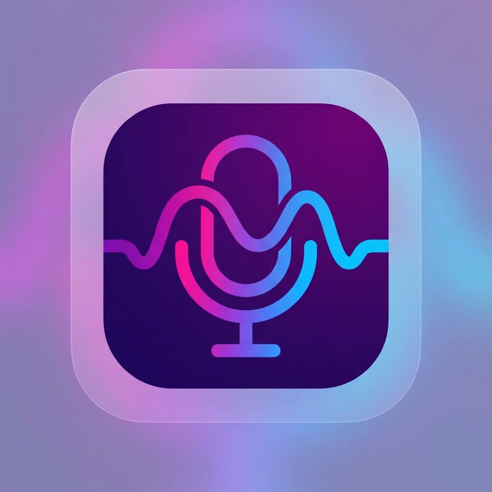

# Audio Transcription System (Verba)



**Offline-first meeting assistant with transcription and summarization**

A privacy-focused audio transcription system that runs entirely locally on your machine. Perfect for recording Zoom meetings, lectures, interviews, or any audio content with automatic transcription and AI-powered summarization.

## ✨ Features

- 🎤 **Audio Recording** - Record system audio and microphone simultaneously
- 📝 **Automatic Transcription** - Using OpenAI's Whisper model (runs locally)
- 🤖 **AI Summarization** - Get key points, decisions, and action items
- 💾 **Session Management** - Save, browse, and export your recordings
- 🔒 **100% Private** - No cloud, no tracking, everything runs locally
- 🚀 **One-Click Launch** - Desktop icon that auto-starts everything
- 🌐 **Browser-Based** - Simple web interface, no installation needed

## 🚀 Quick Start

### 📥 Download & Install

Choose your platform and download the installer:

#### 🪟 **Windows**
1. Download [`verba-2.0.0-x64-setup.exe`](https://github.com/OP-88/Audio_Transcription_Sys/releases/latest)
2. **Double-click** the installer
3. Follow the setup wizard
4. **Done!** Launch from Start Menu or Desktop icon

#### 🍎 **macOS**
1. Download [`verba-2.0.0-macOS.zip`](https://github.com/OP-88/Audio_Transcription_Sys/releases/latest)
2. **Extract** the ZIP file
3. **Drag** Verba.app to Applications folder
4. **Right-click** → Open (first time only)
5. **Done!** Launch from Applications

#### 🐧 **Linux**

**Debian/Ubuntu:**
```bash
# Download and install
wget https://github.com/OP-88/Audio_Transcription_Sys/releases/latest/download/verba-2.0.0-amd64.deb
sudo dpkg -i verba-2.0.0-amd64.deb

# Launch
verba
```

**Fedora/RHEL/CentOS:**
```bash
# Download and install
wget https://github.com/OP-88/Audio_Transcription_Sys/releases/latest/download/verba-2.0.0-1.x86_64.rpm
sudo rpm -i verba-2.0.0-1.x86_64.rpm

# Launch
verba
```

---

### 🎯 First Time Setup

After installation, you'll need to set up audio recording:

#### 🪟 **Windows - System Audio Setup**

Windows requires one-time audio configuration:

1. **Run the audio setup script:**
   - Find `setup-audio.bat` in installation folder
   - **Right-click** → Run as Administrator

2. **Choose your method:**
   - **Stereo Mix** (built-in, if available)
   - **VB-Audio Virtual Cable** (recommended, free download)
   - **Browser Screen Sharing** (zero setup, works everywhere)

3. **Test it!** Try recording with the app

> **💡 Tip:** Browser screen sharing is the easiest - just click "Share Audio" when recording!

#### 🍎 **macOS - System Audio**

macOS has two options for system audio:

**Option 1: BlackHole (Recommended)**
1. Download [BlackHole](https://github.com/ExistentialAudio/BlackHole/releases)
2. Install and follow their setup guide
3. Launch Verba and record!

**Option 2: Browser Screen Sharing (Easiest)**
- No setup needed!
- Click RECORD → Select "System Audio"
- Choose "Share Audio" in browser dialog
- **Done!**

#### 🐧 **Linux - PulseAudio**

Linux works out of the box with PulseAudio:

**Automatic Setup:**
```bash
# Run the setup script
./setup-audio.sh
```

This creates a virtual audio device for system audio recording.

---

### 🎬 Using Verba

1. **Launch the app** (use your platform's method above)
2. **Click RECORD** button
3. **Select audio source:**
   - 🔊 **System Audio** - Record videos, music, podcasts
   - 🎤 **Microphone** - Record your voice
4. **Click STOP** when done
5. **Get instant transcription** with AI summary!

**New in v2.0.0:** ✨ Record for **4+ hours** without crashes! Progressive upload keeps memory low.

---

## 💻 Developer Installation

Want to run from source? Here's how:

### Prerequisites

- **Python 3.8+** with pip
- **Node.js 16+** with npm
- **FFmpeg** (for audio processing)

### Setup

1. **Clone the repository:**
```bash
git clone https://github.com/OP-88/Audio_Transcription_Sys.git
cd Audio_Transcription_Sys
```

2. **Run the setup script:**

**Windows:**
```cmd
setup.bat
```

**macOS/Linux:**
```bash
./setup.sh
```

That's it! The setup script will:
- ✅ Install backend dependencies (Python packages)
- ✅ Install frontend dependencies (Node packages)
- ✅ Make launchers executable
- ✅ Install desktop icon (Linux only)

### Launch Verba

Choose the method for your platform:

#### 🪟 Windows
**Option 1** (Double-click):
- Double-click `start-verba.bat` in File Explorer

**Option 2** (Command Line):
```cmd
start-verba.bat
```

#### 🍎 macOS
**Option 1** (Double-click):
- Double-click `start-verba.command` in Finder
- *First time:* Right-click → Open → Confirm

**Option 2** (Terminal):
```bash
./start-verba.command
```

#### 🐧 Linux
**Option 1** (Desktop Icon):
- Install desktop launcher:
  ```bash
  mkdir -p ~/.local/share/applications
  cp verba.desktop ~/.local/share/applications/
  update-desktop-database ~/.local/share/applications/
  ```
- Find "Verba" in your applications menu and click to launch

**Option 2** (Terminal):
```bash
./start-verba.sh
```

#### 🌍 Cross-Platform (Any OS)
Use the Python launcher:
```bash
python start-verba.py
# or
python3 start-verba.py
```

### What Happens Next

The launcher will:
1. ✅ Start the backend server (http://localhost:8000)
2. ✅ Start the frontend server (http://localhost:5173)
3. ✅ Open your browser automatically
4. ✅ You're ready to record!

### For Zoom Meetings

1. Launch Verba before or during your meeting
2. Click "Record" in the browser
3. Select "Monitor of Verba Combined Audio" as your input
4. Join/continue your Zoom meeting
5. Click "Stop" when done
6. Get instant transcription and summary!

## 🎵 Audio Setup (System Audio Capture)

To record **system audio** (Zoom meetings, browser audio, etc.), follow the setup for your platform:

### 🪟 Windows

Run the audio setup script:
```cmd
setup-audio.bat
```

This script will help you enable one of these options:

**Option 1: Stereo Mix** (if available on your PC)
- Built into Windows, free
- The script will guide you to enable it in Sound Settings

**Option 2: VB-Audio Virtual Cable** (recommended if Stereo Mix unavailable)
- Download from: https://vb-audio.com/Cable/ (free)
- Install it, then set "CABLE Input" as default playback
- Verba will detect "CABLE Output" as a recording device

**Option 3: Browser Screen Sharing** (no setup required!)
- Click Record in Verba
- Select "System Audio" → Browser asks to share screen
- Choose the Zoom window or tab and CHECK "Share audio"

### 🍎 macOS

**Option 1: Browser Screen Sharing** (easiest, no setup)
- Same as Windows Option 3 above
- Works in Chrome/Edge for tab audio or app window audio

**Option 2: BlackHole** (for system-wide audio)
- Download from: https://github.com/ExistentialAudio/BlackHole
- Install BlackHole 2ch
- Create Multi-Output Device in Audio MIDI Setup
- Verba will detect BlackHole as recording source

### 🐧 Linux

The system automatically configures PulseAudio to capture both system audio and microphone. You'll be able to **hear** what's playing while it's being recorded.

To manually setup audio:
```bash
./setup-audio.sh
```

Then in your browser, select **"Monitor of Verba Combined Audio"** as the audio input.

---

**Note:** Microphone recording works out-of-the-box on all platforms without any setup!

## 📁 Project Structure

```
Audio_Transcription_Sys/
├── backend/           # FastAPI server
│   ├── app.py        # Main API server
│   ├── transcriber.py # Whisper integration
│   ├── summarizer.py  # AI summarization
│   └── storage.py     # Session management
├── frontend/          # React + Vite UI
│   └── src/
│       ├── components/
│       └── api.js
├── start-verba.sh     # Auto-launcher script
├── setup-audio.sh     # Audio configuration
└── verba.desktop      # Desktop entry
```

## 🛠️ Configuration

### Backend (`backend/settings.py`)
- Whisper model size (base, small, medium, large)
- Device (CPU/CUDA)
- Audio preprocessing options

### Frontend
- Runs on http://localhost:5173
- Backend API on http://localhost:8000

## 🔧 Requirements

- Python 3.8+
- Node.js 16+
- PulseAudio (Linux)
- FFmpeg (for audio processing)

## 📝 License

GPL-3.0 License

## 🙏 Acknowledgments

- [OpenAI Whisper](https://github.com/openai/whisper) - Speech recognition
- [FastAPI](https://fastapi.tiangolo.com/) - Backend framework
- [React](https://react.dev/) - Frontend framework
- [Vite](https://vitejs.dev/) - Build tool

## 🤝 Contributing

Contributions are welcome! Feel free to open issues or submit pull requests.

## 📧 Support

For issues and questions, please visit the [Issues](https://github.com/OP-88/Audio_Transcription_Sys/issues) page.

---

**Built with ❤️ for privacy and local-first software**
